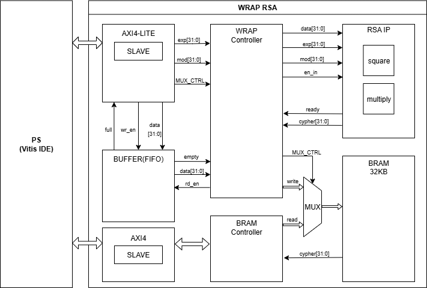

# RSA WRAPPER (FPGA / AXI-based Design)

## Overview

This project implements an FPGA-based RSA WRAPPER integrated within a Zynq SoC environment.  
The design includes a FIFO-based controller, AXI-based communication interfaces, and BRAM integration to enable efficient hardware acceleration and system-level interaction between the Processing System (PS) and Programmable Logic (PL).

## Architecture

### RSA IP Timing Diagram

---

### RSA Controller Timing Diagram

---

### WRAP RSA System Architecture

## Key Features

- FIFO-based RTL controller design
- AMBA AXI interface integration
- PS–PL communication in Zynq SoC
- BRAM-based data buffering

## Environment

- Zynq SoC Platform
- Vitis/Vivado
- Verilog RTL Design
- AMBA AXI Interconnect

## Spec

- RSA IP used - Trust Hub BASICRSA - T100
- FPGA : ARTY Z7
- Vivado Xilinx IP : FIFO, BRAM
